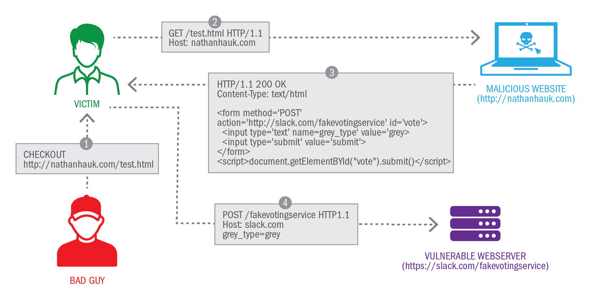

http://php.net/manual/es/security.general.php

# CSRF

El ataque se puede prevenir generando un token y enviando el token en una entrada oculta en el formulario. Además, establece una variable de sesión para el token. En su formulario PHP que recibe los datos del POST, verifique si el token de sesión y el token enviado coinciden. Si coinciden, el formulario provino de su sitio.

# HPP

Un ataque de polución de parámetros HTTP consiste en la inyección de delimitadores de query string codificados en otros parámetros existentes. Si el parámetro en el que se ha realizado la inyección no se valida correctamente y se utiliza decodificado para generar una URL, el atacante puede insertar uno o más parámetros en dicha URL. 

http://www.elladodelmal.com/2011/03/hpp-http-parameter-pollution.html

# Bytes nulos

http://php.net/manual/es/security.filesystem.nullbytes.php

# XSS

# Ataques

https://www.owasp.org/index.php/Category:Attack